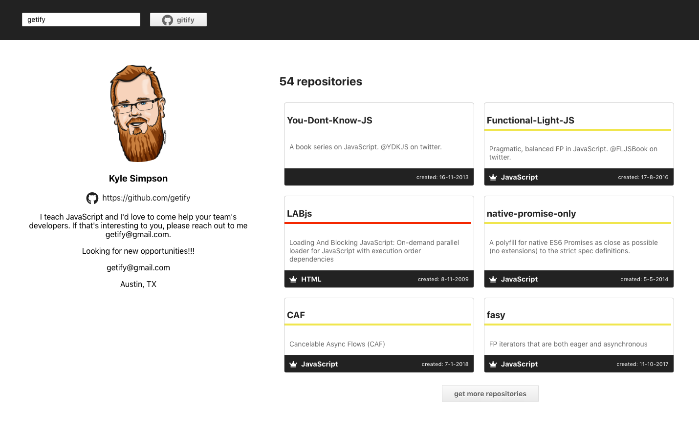

# What it's about?

Build an interface using React, Apollo & Github's GraphQl API to fetch and display data about a given Github user.

The app is simple, containing only one input for the user login name.
On submit, the data gets fetched and displayed.



## Get it up running
1. Clone or download the repository
2. Open up your terminal and cd into the root of the repository
3. Run ```npm install``` to install all dependencies
4. Copy the file ```.env.example``` located in the root or the repository and rename it to ```.env```
5. Go to your Github account and generate a personal access token for the scope 'user'. If you don't know how, just follow [https://help.github.com/en/github/authenticating-to-github/creating-a-personal-access-token-for-the-command-line](https://help.github.com/en/github/authenticating-to-github/creating-a-personal-access-token-for-the-command-line)
6. Replace the placeholder for ```REACT_APP_AUTH_TOKEN``` in you  ```.env``` file with your access token and save the changes.
7. Now you should be good to go, just run ```npm start```to start up the server and you should be able to see the app running at ```http://localhost:3000/```

## Considerations
The project is created with `create-react-app` which is just a great way to get started without spending a lot of time on setup. After that I wanted to keep things lean and didn't install a lot of additional packages to make things sweeter, but got to have `prop-types`.

Since this has been the **very first time** that I have used GraphQL and Apollo, I have chosen not to implement TypeScript into the project as well. Instead I've spent quite some time getting to know and play around with GitHubs GraphQL API by using Github's GraphQL Explorer,  handle Errors and implemented a simple pagination to fetch more repositories.

### Design
I didn't want to spend too much time on the design, so I got heavily inspired by Github's own way of displaying information. I'm sure there's some interesting data to be fetched, but I sticked to the obvious - just to get things going.

### Number of Components
Due to the limited scope of the project, most elements (e.g. inputs, forms, buttons) are only used once or twice and didn't require a React Component. However, I wanted to show my approach as it would be in a regular project.
I also wanted to show my abilities to handle UI components and responsiveness myself, which is why I didn't use a UI framework.
Instead I installed `font-awesome` to spice up things with icons.

#### Folder structure
Each component folder holds at least three files.
1. `component.js` for the component
2. `component.css` for the styling of the component
3. `index.js` for exporting the component

I found that the components were rather lean, so I didn't also create a `component-container.js`. This is however definitely the approach I would use if there was more business logic to handle.
I could also have exported `component.js` directly, without the index file, but have from previous experience learned, that it's really neat not to specify a specific component file in the import, since it gives more flexibility to rename a file or move code into multiple files.

### Hooks instead of class components
I'm really fond of React hooks, which is why the entire application is built with functional components only. I tried to be consistent, which is why I also went with a hook for querying, instead of other possible approaches.

## Next steps
* Due to time limitation, there are no tests. This would definitely be worth to work on, since it makes it so much easier to keep on developing on the project without breaking stuff.
* GraphQL is fun and Github's API seems to have a lot to play with. I will absolutely spend more time on digging around and fiddling with e.g. Mutation!
* Get TypeScript in there - just for trying it out
